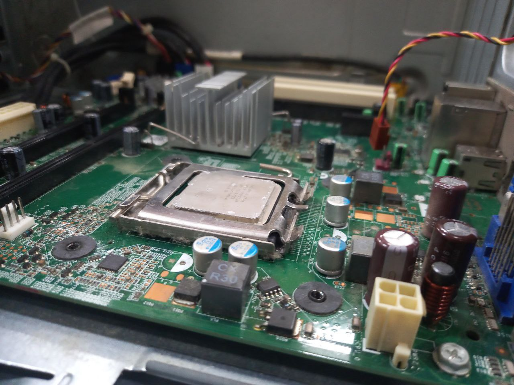

## 💭Reflection
<h3>PC Assemble🖥️</h3>

Reflecting on the process of assembling and disassembling a CPU, I gained valuable insights into the intricacies of computer hardware. This hands-on learning experience bridges theoretical knowledge with practical application, offering me a clearer understanding of how components like the motherboard, random access memory (RAM), hard disk drive (HDD) and CPU fan interconnect and function as a cohesive system.

Moreover, it helps me to develop essential technical skills, including handling sensitive hardware, using the right tools and following systematic procedures to avoid damage. For example, the chip and the RAM are very sensitive so I have to be careful when handling them. Additionally, CPU assembly requires me to put meticulous attention to detail as properly connecting cables really demands precision and patience.

In short, PC assemble can be said is undoubtedly not just a technical exercise but also a journey of discovery. It cultivates a deeper appreciation for technology and its design while enhancing practical skills that are invaluable in my future. This foundational experience has instilled confidence and prepared me for future challenges in hardware-related projects, ensuring I am better equipped for my career in technology. 

  <h3>-Central Processing Unit (CPU)-</h3>
  
   
  <h3>-Motherboard-</h3>
  
   
  <h3>-Hard Disk Drive (HDD)-</h3>
  
   
  <h3>-Random Access Memory (RAM)-</h3>
  
   
  <h3>-Power Supply-</h3>
  
   
  <h3>-CPU Fan-</h3>
  

